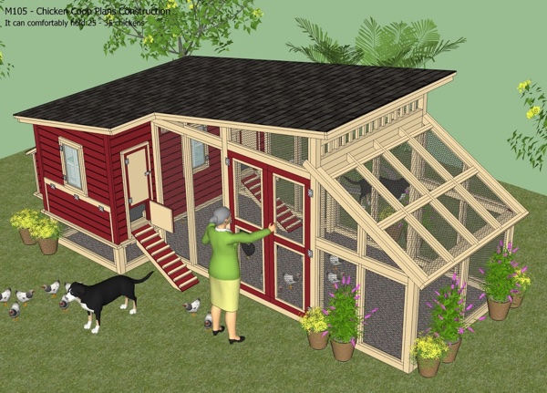

# IOT Chicken Coop

So we decided to get chickens for the "farm", therefore, we needed a
chicken coop.  After searching for plans online, we decided to build
this one...

From [Home & Garden
Plans](http://www.homegardendesignplan.com/2013/11/m105-chicken-coop-plans-construction.html)

The plans called for an automatic opener for the doors, so I got to
thinking that it would be great to use a Raspberry Pi to control the
doors.

One thing lead to another, and the next thing you know we are
monitoring about everything that we can with the pi in the coop &
sending the data to an API on a web server, so the IOT Chicken Coop was
born.

This repository will be for all of the scripts that are needed to
interact with the pi.  They will be mainly written in python, which
until this project, I have never writen a single line. I am a PHP developer, and I use
[Laravel](https://www.laravel.com).

## Hardware

This is a list of the major hardware components that I am using:

* Raspberry Pi 3
* Adafruit motor controller
* Adafruit RGB LCD Plate
* Black & Decker cordless screwdrivers

## Sensors

This is a list of sensors that I am using:

* Waterflow
* Temperature
* Scales
* Magnetic contact switches
* Photocells